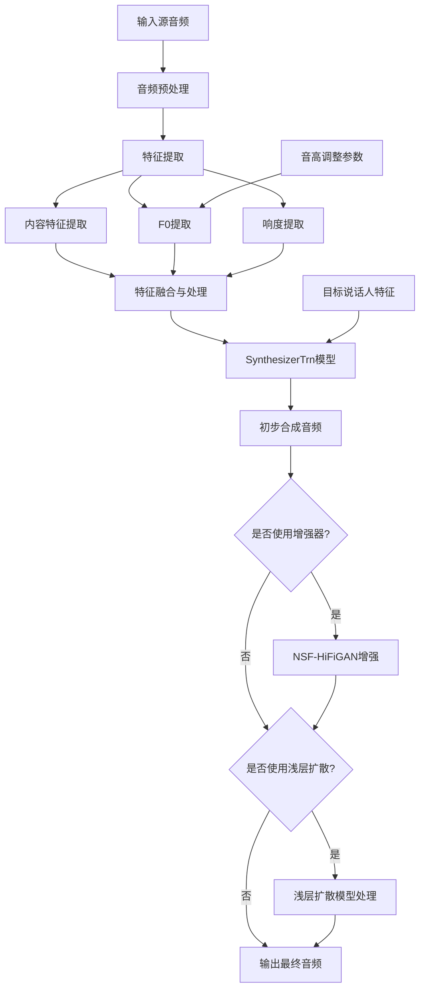
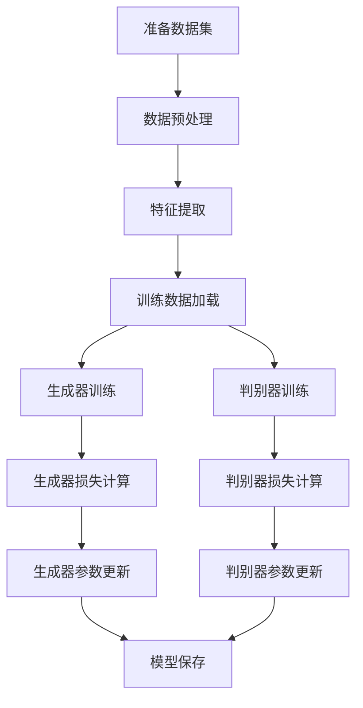
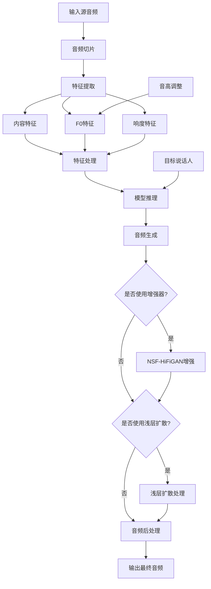
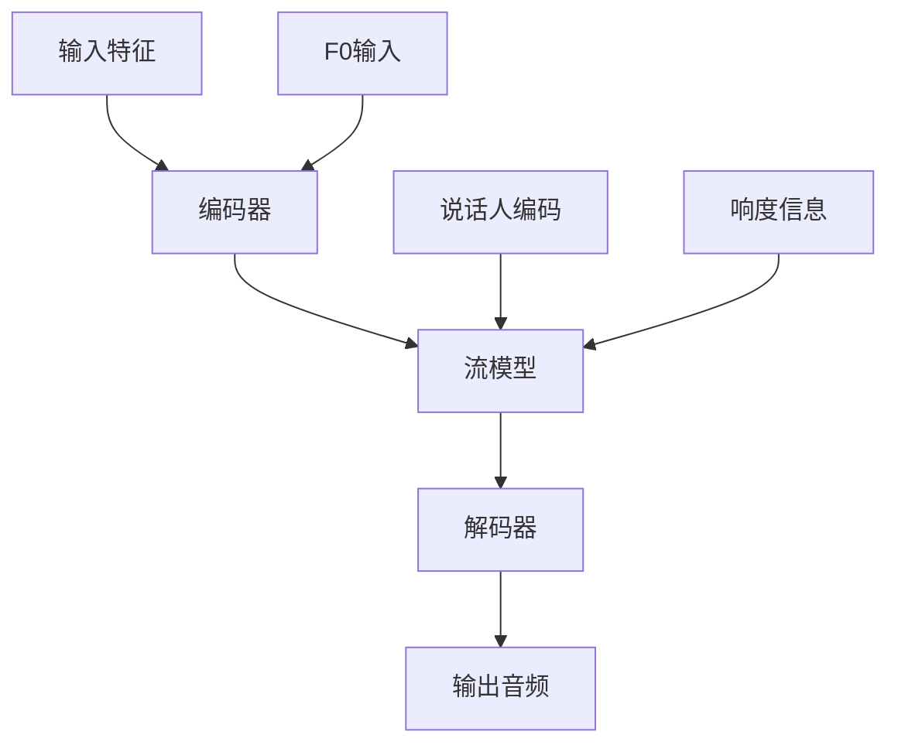
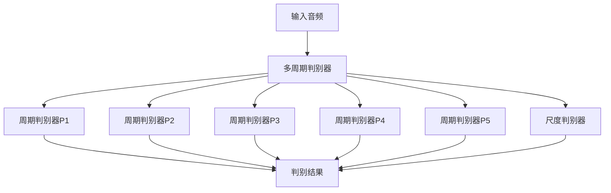
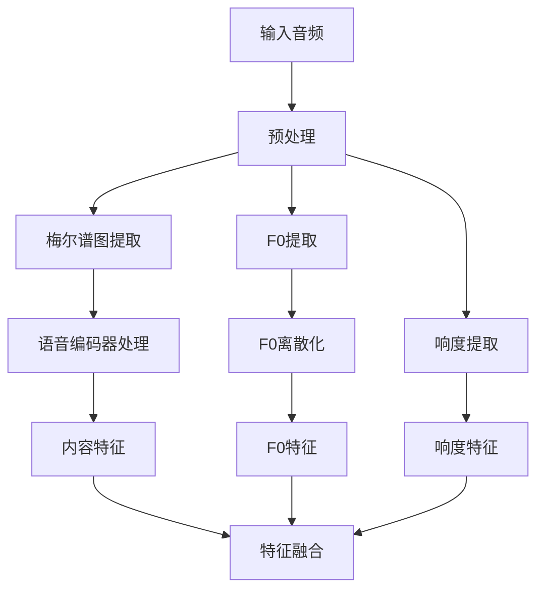
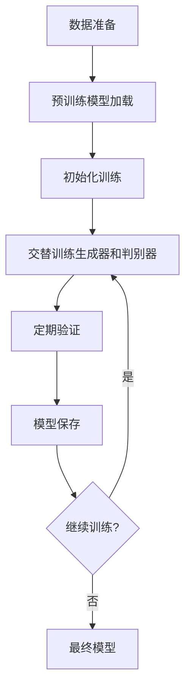
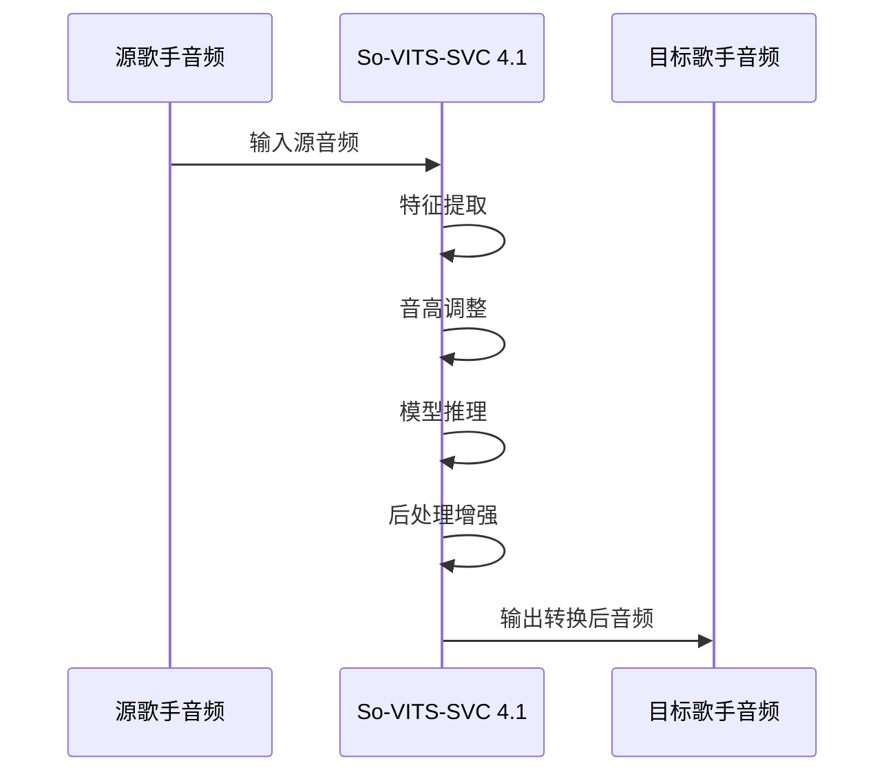

# sovitsvrc
# So-VITS-SVC 4.1 流程图与模型详解

## 1. 整体流程图

## 2. 训练流程图

## 3. 推理流程图

## 4. 模型详细说明

### 4.1 语音编码器模型

So-VITS-SVC 4.1支持多种语音编码器，用于提取音频的内容特征：

#### 4.1.1 ContentVec

ContentVec是基于自监督学习的语音表示模型，在So-VITS-SVC 4.1中主要使用其第12层Transformer的输出作为特征。

**架构特点：**
- 基于Transformer的编码器架构
- 预训练模型：checkpoint_best_legacy_500.pt
- 输出维度：768维特征向量（vec768l12）或256维特征向量（vec256l9）
- 采用自监督学习方式训练，无需标注数据

**工作原理：**
ContentVec通过对输入音频进行编码，提取与语音内容相关但与说话人身份无关的特征表示，这使得模型能够保留音频的语义内容，同时允许改变声音特征。

#### 4.1.2 HubertSoft

HubertSoft是另一种自监督学习的语音表示模型，提供了与ContentVec类似但不同的特征表示。

**架构特点：**
- 基于HUBERT（Hidden-Unit BERT）架构
- 预训练模型：hubert-soft-0d54a1f4.pt
- 通过量化和重建任务进行训练

#### 4.1.3 Whisper-PPG

Whisper-PPG是4.1版本新增的编码器选项，基于OpenAI的Whisper模型。

**架构特点：**
- 基于Transformer的编码-解码架构
- 预训练模型：medium.pt
- 原本设计用于语音识别，在这里用于提取语音特征

### 4.2 F0预测器模型

F0（基频）预测器负责提取和处理音高信息，So-VITS-SVC 4.1支持多种F0提取算法：

#### 4.2.1 Parselmouth (PM)

**特点：**
- 基于Praat的F0提取算法
- 较为稳定，是默认的F0提取方法
- 适用于大多数场景

#### 4.2.2 CREPE

**特点：**
- 基于深度学习的F0提取方法
- 使用卷积神经网络进行预测
- 在噪声环境下表现更好
- 可以通过f0_filter_threshold参数调整，降低该值可减少跑调概率，但会增加哑音

#### 4.2.3 Harvest与DIO

**特点：**
- 来自librosa库的F0提取算法
- 提供了不同的提取特性
- 适用于不同类型的音频

### 4.3 主干网络 - SynthesizerTrn

SynthesizerTrn是So-VITS-SVC的核心模型，基于VITS架构但进行了修改以适应歌声转换任务。

**架构组成：**

#### 4.3.1 编码器 (Encoder)

**功能：** 处理输入的内容特征和F0信息
**结构：**
- 预卷积层处理输入特征
- WaveNet风格的卷积网络
- 输出均值和对数方差，用于后续的随机采样

#### 4.3.2 流模型 (Flow)

**功能：** 使用可逆流模型进行特征变换
**结构：**
- 基于ResidualCouplingBlock的流模型
- 多层耦合变换
- 集成说话人信息

#### 4.3.3 解码器 (Decoder)

**功能：** 生成最终的音频波形
**结构：**
- HiFiGAN风格的解码器
- 多层上采样卷积
- 残差块处理

#### 4.3.4 说话人编码器 (Speaker Encoder)

**功能：** 处理目标说话人的身份信息
**结构：**
- 嵌入层表示不同说话人
- 支持说话人混合

### 4.4 判别器模型 - MultiPeriodDiscriminator

判别器用于对抗训练，评估生成音频的质量。

**架构组成：**

#### 4.4.1 周期判别器 (DiscriminatorP)

**功能：** 在不同周期上评估生成音频的质量
**结构：**
- 多个不同周期的判别器（2, 3, 5, 7, 11）
- 2D卷积网络
- 输出真假判断和特征图

#### 4.4.2 尺度判别器 (DiscriminatorS)

**功能：** 在不同尺度上评估生成音频的质量
**结构：**
- 1D卷积网络
- 多层下采样
- 输出真假判断和特征图

### 4.5 浅层扩散模型

4.1版本新增的浅层扩散模型，用于提升音质和解决电音问题。

**架构特点：**
- 基于DDSP-SVC的扩散模型
- 通过k_step参数控制扩散步数
- 支持二次编码选项

**工作原理：**
浅层扩散模型通过迭代去噪过程，逐步改善生成音频的质量。与完整的扩散模型相比，浅层扩散只进行有限步数的迭代，在保持计算效率的同时提升音质。

### 4.6 NSF-HiFiGAN增强器

NSF-HiFiGAN是一个可选的音频增强器，用于提升音质。

**架构特点：**
- 基于HiFiGAN的神经源滤波器模型
- 多层上采样卷积
- 残差块和MRF（多感受野融合）模块

**工作原理：**
NSF-HiFiGAN通过神经源滤波器架构，对生成的音频进行增强处理，提升音质和自然度。对于训练数据较少的模型，这种增强可以显著改善结果，但对于训练充分的模型可能会有反作用。

## 5. 数据流与处理细节

### 5.1 特征提取流程

### 5.2 训练损失函数

So-VITS-SVC 4.1训练过程中使用了多种损失函数：

1. **生成器损失**
   - 对抗损失：使生成的音频能够欺骗判别器
   - 特征匹配损失：使生成音频的特征与真实音频的特征相似
   - KL散度损失：正则化潜在空间
   - F0损失：确保音高的准确性

2. **判别器损失**
   - 真实样本损失：正确识别真实音频
   - 生成样本损失：正确识别生成的音频

### 5.3 推理参数调优

推理过程中，可以通过调整多种参数来优化转换效果：

1. **音高调整**：通过trans参数调整输出音高
2. **噪声尺度**：通过noise_scale参数控制随机性
3. **聚类比例**：通过cluster_infer_ratio参数控制聚类特征的使用比例
4. **扩散步数**：通过k_step参数控制浅层扩散的迭代次数
5. **响度调整**：通过loudness_envelope_adjustment参数控制响度包络的融合比例

## 6. 模型训练与优化策略

### 6.1 训练策略

### 6.2 优化技巧

1. **学习率预热**：在训练初期逐渐增加学习率
2. **学习率衰减**：随着训练进行逐渐降低学习率
3. **梯度缩放**：使用GradScaler进行FP16混合精度训练
4. **分布式训练**：支持多GPU并行训练
5. **模型检查点**：定期保存模型，支持断点续训

## 7. 实际应用示例

### 7.1 歌声转换流程

### 7.2 参数调优建议

| 参数 | 建议值 | 影响 |
|-----|-------|-----|
| trans | -12 到 +12 | 音高调整，根据需要调整 |
| noise_scale | 0.3 - 0.8 | 值越大，音质越多样但可能不稳定 |
| f0_predictor | pm/crepe | 根据音频质量选择合适的F0提取器 |
| cluster_infer_ratio | 0 - 1 | 值越大，越接近聚类中心音色 |
| k_step | 30 - 200 | 扩散步数，越大效果越好但速度越慢 |

## 8. 模型性能与局限性

### 8.1 性能表现

So-VITS-SVC 4.1在以下方面表现优异：
- 高质量的音色转换
- 良好的音高控制
- 支持多种语音编码器
- 浅层扩散带来的音质提升

### 8.2 局限性

模型仍然存在一些局限：
- 对训练数据质量和数量有较高要求
- 某些情况下可能出现电音或伪音
- 实时转换仍有挑战
- 极端音高转换可能导致音质下降

## 9. 未来发展方向

1. **实时转换优化**：进一步提升推理速度，实现更好的实时转换体验
2. **多语言支持增强**：改进对不同语言歌声的转换能力
3. **情感控制**：增加对歌声情感特征的控制
4. **更高效的训练**：减少训练数据需求，提高训练效率
5. **更好的音质**：继续改进扩散模型和增强器，提升音质 
