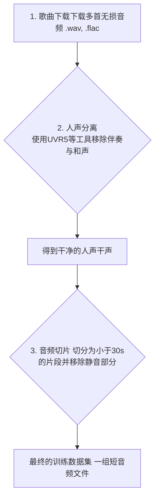
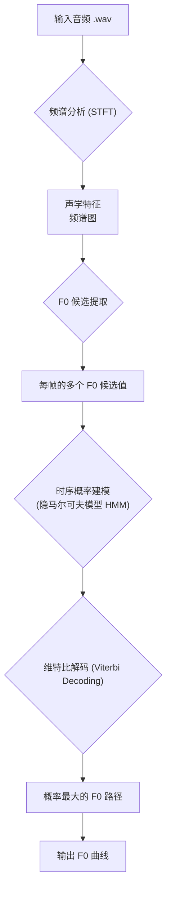
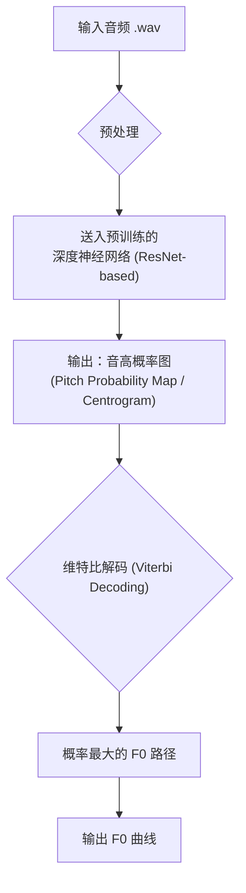

# F0提取器工作流程详解：PM vs. RMVPE

## 1. 引言

在 So-VITS-SVC 项目中，F0（基频）提取器是保证歌声转换成功的基石。它负责从原始音频中准确地分离出代表旋律的音高曲线。项目提供了多种 F0 提取器供用户选择，其中 `pm` 和 `rmvpe` 是两种代表性的算法，它们分别体现了**经典信号处理**和**现代深度学习**两种不同的技术路线。

本文档将通过流程图和详细说明，解析这两种 F0 提取器的工作原理。

---

## 2. 训练数据预处理流程

在进行 F0 提取之前，首先需要准备高质量的训练数据集。这个过程本身就是一个独立的工作流，目的是从原始歌曲中提取出干净、标准化的短音频片段。

### 2.1. 数据预处理流程图

### 2.2. 预处理步骤详解

1.  **歌曲下载**: 收集尽可能多的高质量、无损格式（如 WAV, FLAC）的源音频。音频数量越多，模型泛化能力越强。
2.  **人声分离**: 这是关键的一步。使用 Ultimate Vocal Remover (UVR5) 或类似的工具，从原始音频中将人声（Vocal）与伴奏（Instrumental）/和声（Harmony）分离，只保留干净的人声干声（acapella）。
3.  **音频切片**: 将上一步得到的长音频文件，切分成适合模型训练的短片段（通常建议 30 秒以内）。同时，需要剔除片段中的静音部分，确保每个片段都包含有效的人声。

经过以上处理，得到的音频片段集合就可以用于后续的特征提取（包括 F0 提取）和模型训练了。

---

## 3. PM (Probabilistic Monaural F0 tracker)

`pm` 是一个基于**概率模型**的 F0 提取器。它的核心思想是：F0 的轨迹在时间上是连续且平滑的，因此可以通过寻找一个概率最大的 F0 序列来得到最可靠的结果。

### 3.1. PM 工作流程图

### 3.2. PM 步骤详解

1.  **频谱分析 (STFT)**: 首先，通过短时傅里叶变换（STFT）将一维的音频波形转换为二维的频谱图，展现出音频在不同时间和频率上的能量分布。

2.  **F0 候选提取**: 对频谱图的每一个时间帧，算法会使用一些信号处理技巧（如倒谱分析、自相关函数等）来寻找多个可能的 F0 候选值。例如，在一个男声唱"啊"的音高时，除了基频 100Hz 外，它的谐波 200Hz、300Hz 也可能被误判为基频，因此在这一步会产生多个候选。

3.  **时序概率建模**: 这是 `pm` 的核心。它将 F0 轨迹看作一个**隐马尔可夫模型（HMM）**。
    *   **状态（State）**: 模型的每个状态对应一个可能的 F0 值或"非语音"状态。
    *   **观测概率（Emission Probability）**: 对于第2步中提取的每个候选值，模型会计算它作为"真实"F0 的概率。
    *   **转移概率（Transition Probability）**: 模型定义了 F0 在相邻帧之间变化的概率。例如，从 100Hz 跳到 105Hz 的概率很高（平滑过渡），而从 100Hz 突变到 500Hz 的概率则很低（剧烈跳变）。

4.  **维特比解码 (Viterbi Decoding)**: 维特比算法是一种动态规划算法，它能在 HMM 中找到概率最大的一条路径。在这里，它被用来在所有 F0 候选值构成的复杂网络中，找出一条**整体上最平滑、最符合声学特征的 F0 序列**。

5.  **输出**: 最终输出这条概率最大的 F0 路径，即为最终的 F0 曲线。

**特点**: 速度快，不依赖深度学习模型，在简单、清晰的干声上表现良好。但在处理复杂的抖音、滑音或噪声较大的音频时，准确度可能会下降。

---

## 4. RMVPE (Robust Monaural Vocal Pitch Estimator)

`rmvpe` 是一个基于**深度学习**的 F0 提取器，也是目前 So-VITS-SVC 社区**首选**的方案。它通过在一个巨大的、高质量的歌声数据集上进行训练，学习到了从音频直接到音高概率的复杂映射关系，因此极为鲁棒和精准。

### 4.1. RMVPE 工作流程图

### 4.2. RMVPE 步骤详解

1.  **预处理**: 对输入音频进行标准化等操作，使其符合模型输入要求。

2.  **深度神经网络**: 这是 `rmvpe` 的核心。音频数据被送入一个巨大的、预训练好的**深度神经网络**（通常是基于 ResNet 的变体）。这个网络被训练用来完成一个任务：**预测在每个时间点上，每个音高（例如从 20Hz 到 20000Hz 的几百个离散音高点）是真实基频的概率**。

3.  **输出音高概率图**: 模型的输出不是一个单一的 F0 值，而是一个二维的**概率图**。这个图的横轴是时间，纵轴是音高，图上每个点的值代表了"在某个时间，某个音高是真实 F0"的概率。因此，一条清晰的 F0 曲线会在这个图上呈现为一条明亮的轨迹。

4.  **维特比解码 (Viterbi Decoding)**: 尽管深度模型已经非常强大，但其输出的概率图仍可能存在一些模糊或不确定的地方。因此，`rmvpe` 同样使用**维特比解码**作为后处理步骤。它在这个二维概率图上寻找一条总概率最高、且最平滑的路径，有效地滤除了异常点和噪声，确保了 F0 曲线的时序连续性。

5.  **输出**: 最终输出这条通过解码得到的最佳 F0 路径。

**特点**: **极其精准和鲁棒**，对复杂的歌声技巧（如真假声转换、气声、颤音）和一定的背景噪声都有很好的抵抗力。计算开销比 `pm` 大，需要加载一个较大的深度学习模型。

---

## 5. 总结与对比

| 特性 | PM | RMVPE |
| :--- | :--- | :--- |
| **核心原理** | 信号处理 + 概率模型 (HMM) | 深度学习 (ResNet-based) |
| **准确度** | 良好 | **极高 (State-of-the-art)** |
| **鲁棒性** | 标准，对复杂技巧和噪声敏感 | **极强** |
| **计算速度** | **快** | 相对较慢 |
| **依赖** | 标准信号处理库 | 大型预训练模型文件 |
| **推荐场景** | 快速预览、对精度要求不高的场景 | **高质量模型训练、最终推理** | 
