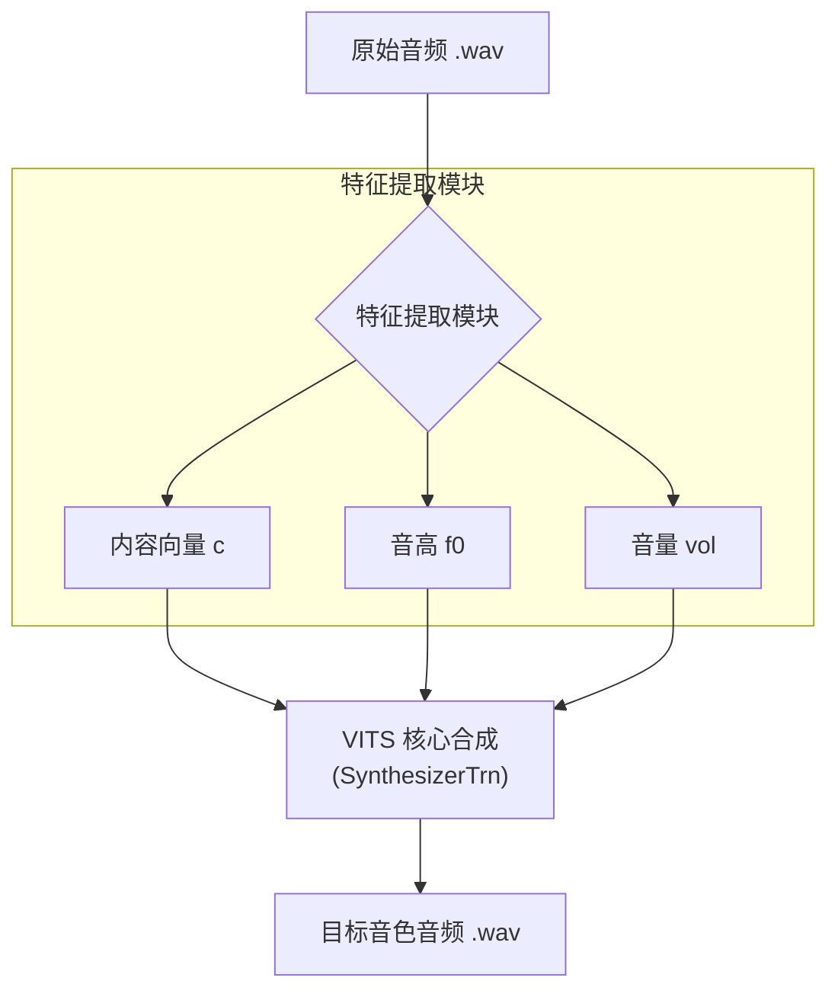
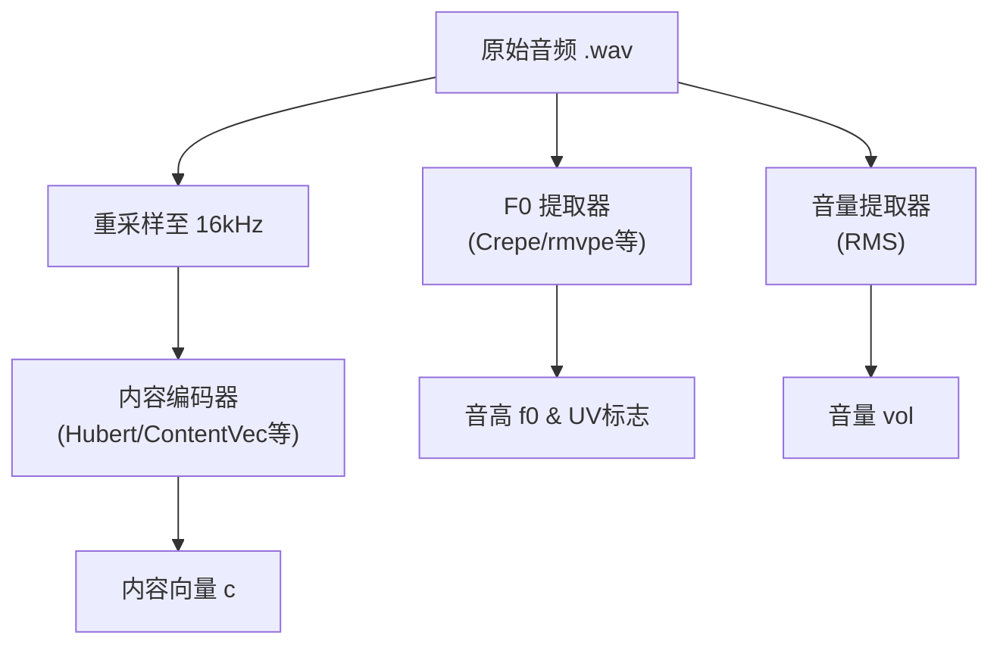
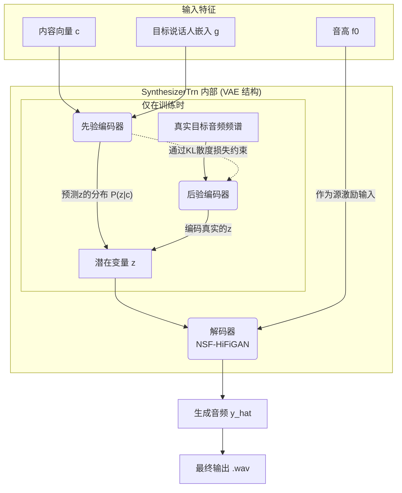
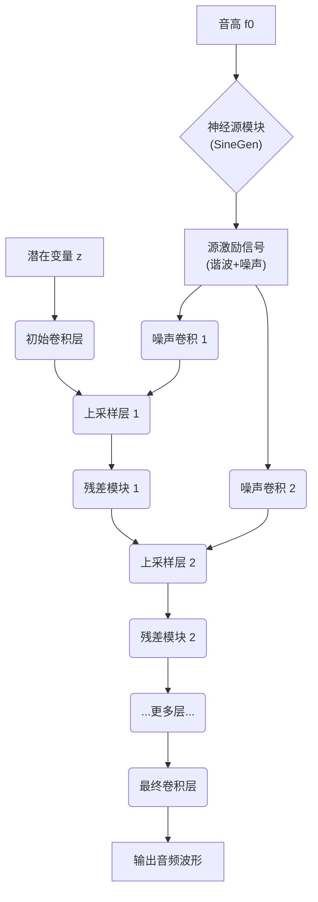
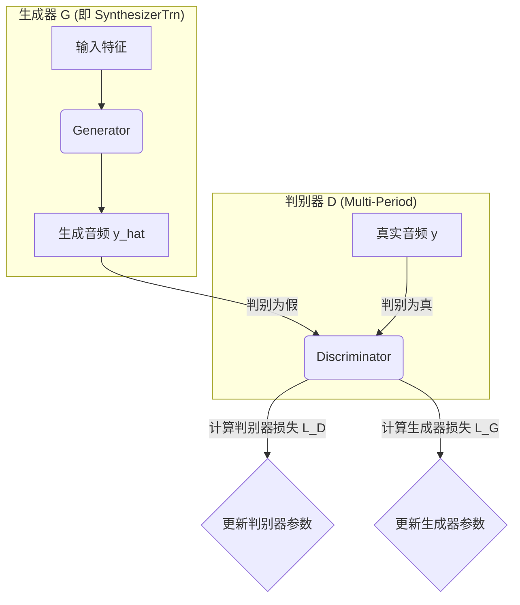

# So-VITS-SVC 4.1: VITS 端到端模型流程图与详解

## 1. 引言

So-VITS-SVC (Singing Voice Conversion) 4.1 是一个先进的歌声转换框架。本文档将聚焦于其核心、高效的**端到端 VITS 流程**，通过多层级的流程图和详尽的文字说明，深入解析从原始音频输入到目标音色输出的每一个技术环节，包括其背后的关键算法和数学原理。

---

## 2. 总体工作流

VITS 模型的整体工作流程可以概括为两个核心阶段：**特征提取**和**模型合成**。

*   **流程解释**:
    1.  **输入**: 一段原始的、干声的歌唱音频（`.wav` 格式）。
    2.  **特征提取**: 系统首先从原始音频中并行提取三个关键信息：
        *   **内容 `c`**: 唱的是什么（歌词内容）。
        *   **音高 `f0`**: 旋律是怎样的。
        *   **音量 `vol`**: 演唱的力度变化。
    3.  **模型合成**: 提取出的特征被送入 `SynthesizerTrn` 核心模型，该模型利用这些特征，结合预先训练好的目标歌手音色，生成最终的音频。

---

## 3. 模块一：特征提取详解

特征提取是保证歌声转换"只换音色，不换内容和旋律"的关键。

*   **流程解释**:
    1.  **内容编码 (Content Encoding)**:
        *   原始音频首先被重采样到 16kHz，以匹配内容编码器的要求。
        *   随后，**自监督学习模型**（如 Hubert、ContentVec）对音频进行编码。其核心算法是**"掩码预测"**：通过预测音频中被随机遮盖的部分，模型被迫学习到语音的深层语言学结构，从而提取出与音色无关的**内容向量 `c`**。
    2.  **音高提取 (Pitch Extraction)**:
        *   **F0 提取器**（如 Crepe、rmvpe 等算法）直接处理原始采样率的音频，计算出逐帧的**音高曲线 `f0`**，以及一个判断该帧是清音还是浊音的 **UV (Unvoiced/Voiced) 标志**。这是保留旋律的核心。
    3.  **音量提取 (Volume Extraction)**:
        *   通过计算音频波形每个帧的**均方根能量 (RMS)**，得到反映演唱力度的**音量曲线 `vol`**。

---

## 4. 模块二：VITS 核心模型 (`SynthesizerTrn`) 详解

这是整个系统的核心，负责将特征合成为目标音色的音频。其内部结构复杂，包含了 VAE 和 GAN 两大框架。

### 4.1. 核心模型内部流程图

*   **流程解释**:
    1.  **输入**: 模型接收特征提取模块的 `c` 和 `f0`，以及一个代表目标音色的**说话人嵌入向量 `g`**。
    2.  **VAE 框架**: 模型的核心是一个**变分自编码器 (VAE)**。
        *   **训练时**:
            *   **后验编码器**是一个**标准化流 (Normalizing Flows)** 网络，它从真实的目标音频频谱 `H` 中提取一个"完美"的、高度压缩的**潜在变量 `z`**。
            *   **先验编码器**则尝试仅通过内容 `c` 和说话人 `g` 来预测 `z` 的分布。
            *   通过 **KL 散度损失** \(L_{kl} = D_{KL}(Q(z|y) || P(z|c, g))\)，强制让先验编码器的预测结果无限接近后验编码器的"真实"结果。
        *   **推理时**: 由于没有真实目标音频，后验编码器被丢弃。我们完全依赖**先验编码器**来根据 `c` 和 `g` 生成潜变量 `z`。
    3.  **解码器**: **解码器 (NSF-HiFiGAN)** 接收潜变量 `z` 和音高 `f0`，负责最终的音频合成。

### 4.2. 解码器 (NSF-HiFiGAN) 内部流程图

*   **流程解释**:
    1.  **双路径输入**: 解码器有两条输入路径。一条是来自 VAE 的**潜在变量 `z`**，它决定了音色和发音细节；另一条是来自特征提取的**音高 `f0`**。
    2.  **神经源生成**: **`SineGen`** 模块根据 `f0` 曲线，为有声段生成包含基频和多个谐波的正弦波，为无声段生成白噪声。这构成了发声的"激励源"。
    3.  **上采样与融合**:
        *   `z` 通过一系列的**转置卷积 (上采样层)**，逐步提高时间分辨率。
        *   在每个上采样阶段，处理过的"激励源"信号被注入进来，与 `z` 的特征进行融合。
        *   **残差模块 (ResBlock)** 在每个分辨率级别上对融合后的特征进行深度非线性处理，极大地扩展了感受野，提升了建模能力。
    4.  **输出**: 经过多层处理后，最终的卷积层将高维特征映射为一维的音频波形数据。

### 4.3. 对抗性训练 (GAN) 流程图

为了让生成的音频更真实、无法与真人演唱区分，整个 `SynthesizerTrn` 模型是通过与一个判别器进行对抗博弈来训练的。

*   **流程解释**:
    1.  **生成与判别**: **生成器 G** 产生假音频 `y_hat`，**判别器 D** 则接收真实音频 `y` 和假音频 `y_hat`。
    2.  **判别器更新**: D 的目标是尽可能准确地将 `y` 判为"真"，`y_hat` 判为"假"。根据其判断的准确性计算**判别器损失 `L_D`**，并更新 D 的网络参数。
    3.  **生成器更新**: G 的目标是"欺骗"D，让 D 把 `y_hat` 判为"真"。根据"欺骗"的成功程度计算**生成器损失 `L_G`**，并更新 G 的网络参数。
    4.  **交替博弈**: 这个过程交替进行，最终 D 的判别能力越来越强，也迫使 G 生成的音频越来越以假乱真。
*   **损失函数**:
    \[
    L_G = L_{adv}(G) + \lambda_{fm} L_{fm}(G, D) + \lambda_{mel} L_{mel}(G) + \lambda_{kl} L_{kl}(G)
    \]
    除对抗性损失外，生成器的总损失还包括：**特征匹配损失 `L_fm`**（稳定GAN训练）、**梅尔频谱重建损失 `L_mel`**（保证内容准确）和 **KL 散度损失 `L_kl`**（VAE核心）。

---

## 5. 总结

So-VITS-SVC 4.1 的核心 VITS 流程是一个高度集成的端到端系统。它通过解耦内容、音高和音色，并利用 VAE 和 GAN 框架的优势，实现了高质量、高效率的歌声转换。其关键特性包括：

*   **无需转录**：通过自监督内容编码器，摆脱了对文本的依赖。
*   **精准的音高渲染**：NSF 结构以音高为核心驱动力，确保了旋律的准确性。
*   **高度真实感**：通过对抗性训练和精心设计的损失函数，生成自然、高保真的音频。
*   **模块化设计**：内容编码器、F0 提取器等均为可替换模块，便于实验和优化。 
