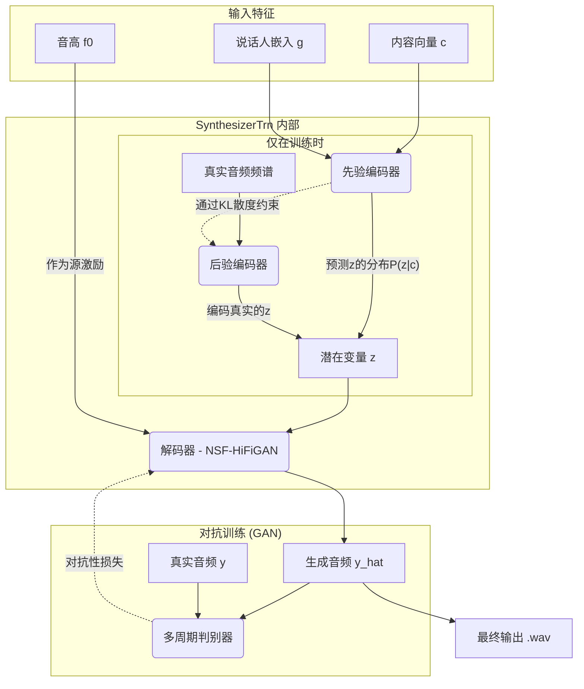

# So-VITS-SVC 4.1 流程图与模型详解

## 1. 引言

So-VITS-SVC (Singing Voice Conversion) 4.1 是一个先进的歌声转换框架，其核心目标是将一首歌中的人声替换为另一个人的声音，同时保留原始的旋律、节奏和表现力。为了实现高质量的转换，该项目提供了两种主要的技术流程：**端到端的 VITS 流程**和**基于扩散模型的流程**。

本文档将通过流程图和详细的文字说明，深入解析这两种流程的内部结构和关键算法。

---

## 2. 总体流程图

无论是哪种流程，第一步都是相同的：从源音频中提取内容、音高和音量等关键特征。然后，这些特征被送入两个可选的合成流水线之一。

```mermaid
graph TD
    A[原始音频 .wav] --> B{特征提取模块};
    
    subgraph 特征提取模块
        B --> C[内容编码器<br>(Hubert/ContentVec等)];
        B --> D[音高提取器<br>(Crepe/Rmvpe等)];
        B --> E[音量提取器<br>(RMS)];
    end

    C --> F[内容向量 c];
    D --> G[音高 f0];
    E --> H[音量 vol];

    subgraph "流程一 (默认/高效)"
        I[SynthesizerTrn (VITS 核心)];
        I --> J[输出音频 .wav];
    end

    subgraph "流程二 (可选/高质量)"
        K[Unit2Mel (扩散模型)];
        L[独立声码器 (HiFi-GAN)];
        K --> L;
        L --> M[输出音频 .wav];
    end
    
    F & G & H --> I;
    F & G & H --> K;
```

---

## 3. 流程一：VITS 端到端模型详解

这是 So-VITS-SVC 的核心和默认流程，它高效、完整，直接从特征生成音频。

### 3.1. VITS 流程图

此流程的核心是 `SynthesizerTrn` 模型，它内部包含了复杂的编码器-解码器结构，并采用对抗性训练来提升真实感。



### 3.2. VITS 模块详解

#### a) 特征提取

*   **内容编码 (Content Encoding)**: 使用自监督学习模型（如 Hubert）将音频波形转换为去除了音色信息的**内容向量 `c`**。其核心算法是"掩码预测"：模型通过预测音频中被随机遮盖的部分，来学习语音的深层语言学结构。
*   **音高提取 (Pitch Extraction)**: 使用深度学习（Crepe, rmvpe）或经典信号处理（dio, harvest）算法，从音频中计算出逐帧的**音高曲线 `f0`**。
*   **音量提取 (Volume Extraction)**: 通过计算波形能量（RMS），得到**音量曲线 `vol`**。

#### b) VITS 核心模型 (`SynthesizerTrn`)

*   **后验编码器 (Posterior Encoder)**: (仅用于训练) 使用**标准化流 (Normalizing Flows)** 从真实音频中提取一个"完美"的潜在变量 `z`。标准化流是一系列可逆的神经网络层，能精确学习数据分布。其核心基于变量代换定理，通过一系列简单的、雅可比行列式易于计算的可逆变换，将复杂的数据分布映射到一个简单的先验分布（如标准正态分布）。

*   **先验编码器 (Prior Encoder)**: (推理时使用) 使用**空洞卷积 (Dilated Convolutions)** 堆叠的类 WaveNet 网络，根据内容向量 `c` 和说话人嵌入 `g` 来预测潜在变量 `z` 的分布。它通过 **KL 散度损失** 来学习模仿后验编码器的行为。其优化目标是最小化两个分布的 KL 散度：
    \[
    L_{kl} = D_{KL}(Q(z|y) || P(z|c, g))
    \]
    其中 \(Q(z|y)\) 是后验编码器从真实音频 \(y\) 中得到的"真实"分布，而 \(P(z|c, g)\) 是先验编码器从内容 `c` 和说话人 `g` 中预测的分布。

*   **解码器 (Decoder - NSF-HiFiGAN)**: 负责最终的音频合成。
    1.  **神经源 (Neural Source)**: `SineGen` 模块根据 `f0` 曲线生成包含谐波的正弦波（有声段）或噪声（无声段），作为发声的"激励源"。
    2.  **滤波器 (Filter)**: 主体是一个 **HiFi-GAN** 网络，它将潜在变量 `z` 通过一系列**转置卷积**进行上采样，同时融合"激励源"的信号，最终渲染出带有目标音色的波形。其上采样层之间穿插着**残差模块 (ResBlock)**，每个 ResBlock 通常由一连串带有不同空洞率的卷积层组成，并包含一个跳跃连接，允许信息在网络中更深层地流动，极大地扩展了感受野。

*   **多周期判别器 (Multi-Period Discriminator)**: 为了提升真实感，该判别器由多个子判别器组成。每个子判别器负责分析一个特定"周期"的音频。例如，周期为 `p` 的子判别器会先将一维音频波形重塑 (reshape) 为一个二维张量，其中第二维的长度为 `p`，然后使用二维卷积进行判断。这种结构对识别与特定频率相关的周期性瑕疵（如"金属感"）非常敏感。

#### c) 训练损失函数

模型由一个多任务损失函数驱动，其生成器 \(G\) 和判别器 \(D\) 的总损失函数可以表示为：
\[
L_G = L_{adv}(G) + \lambda_{fm} L_{fm}(G, D) + \lambda_{mel} L_{mel}(G) + \lambda_{kl} L_{kl}(G)
\]
\[
L_D = L_{adv}(D)
\]
*   **对抗性损失 (\(L_{adv}\))**: 标准的 GAN 损失，用于让生成器学习欺骗判别器，提升音频的真实感。
*   **特征匹配损失 (\(L_{fm}\))**: 计算真实音频和生成音频在判别器各中间层输出的特征图之间的 L1 距离。这为生成器提供了更稳定、更丰富的梯度。
*   **梅尔频谱重建损失 (\(L_{mel}\))**: 计算生成音频的梅尔频谱图与真实音频的梅尔频谱图之间的 L1 距离，保证了核心声学内容的一致性。
*   **KL 散度损失 (\(L_{kl}\))**: 如前所述，约束先验编码器和后验编码器的分布，是 VAE 框架的核心。
*   \(\lambda\) 是各项损失的权重超参数。

---

## 4. 流程二：基于扩散的模型详解

这是一个可选流程，它不直接生成音频，而是先生成高质量的梅尔频谱图，以追求极致的音质。

### 4.1. 扩散模型流程图

```mermaid
graph TD
    subgraph "输入特征"
        A[内容向量 c];
        B[音高 f0];
        C[说话人嵌入 g];
    end
    
    subgraph "Unit2Mel 扩散模型"
        D[随机噪声];
        E{U-Net 核心网络};
        
        D -- "初始输入" --> E;
        E -- "迭代去噪" --> E;
        A & B & C -.->|作为条件注入| E;
    end
    
    subgraph "输出"
        F[梅尔频谱图];
        G[独立声码器<br>(HiFi-GAN)];
        H[最终输出 .wav];
        
        E --> F;
        F --> G;
        G --> H;
    end
```

### 4.2. 扩散模型模块详解

*   **特征提取**: 与 VITS 流程完全相同。

*   **Unit2Mel 扩散模型**:
    *   **核心算法**: 基于**去噪扩散概率模型 (DDPM)**。其核心网络通常是一个 **U-Net** 架构。
    *   **工作原理**:
        1.  **前向过程（加噪）**: 这是一个固定的马尔可夫链过程，它在 \(T\) 个时间步内逐渐向原始梅尔频谱图 \(x_0\) 添加高斯噪声，得到 \(x_1, x_2, ..., x_T\)。每一步的计算公式为：
            \[
            q(x_t|x_{t-1}) = \mathcal{N}(x_t; \sqrt{1-\beta_t}x_{t-1}, \beta_t\mathbf{I})
            \]
            其中 \(\beta_t\) 是预设的噪声方差表。
        2.  **反向过程（去噪）**: 这是模型的学习目标。模型需要学习一个神经网络 \(\epsilon_\theta\) 来预测在任意时间步 \(t\) 添加的噪声 \(\epsilon\)。其简化的优化目标是最小化预测噪声与真实噪声之间的均方误差：
            \[
            L_{diff} = \mathbb{E}_{t, x_0, \epsilon} [||\epsilon - \epsilon_\theta(\sqrt{\bar{\alpha}_t}x_0 + \sqrt{1-\bar{\alpha}_t}\epsilon, t, c)||^2]
            \]
            其中 \(\epsilon\) 是随机采样的真实噪声，\(c\) 是条件信息（内容向量、音高等），\(\bar{\alpha}_t\) 是 \(\beta_t\) 的累积乘积。
    *   **U-Net 架构**:
        *   这是一个对称的编码器-解码器结构。**编码器**部分通过一系列卷积和下采样层来提取特征并减小特征图尺寸。**解码器**部分则通过一系列转置卷积和上采样层来逐步恢复特征图尺寸。
        *   **跳跃连接 (Skip Connections)** 是 U-Net 的关键，它将编码器中对应层级的特征图直接拼接到解码器的输入中，这使得网络能够同时利用高层语义信息和低层细节信息，对于生成高质量图像/频谱图至关重要。
        *   **条件注入 (Conditioning)**: 内容向量 `c`、音高 `f0` 等条件信息，会通过**交叉注意力 (Cross-Attention)** 机制或 **FiLM (Feature-wise Linear Modulation)** 层等方式，在 U-Net 的每一层（或关键层）注入到模型中，从而引导去噪过程朝向我们期望的目标进行。

*   **独立声码器 (Vocoder)**:
    *   **作用**: 将 `Unit2Mel` 模型生成的梅尔频谱图转换为最终的音频波形。
    *   **算法**: 通常使用一个独立的、预训练好的标准 **HiFi-GAN**。

---

## 5. 总结

So-VITS-SVC 4.1 是一个功能强大且灵活的歌声转换系统。其主要创新点和优势包括：

*   **无需转录**：通过自监督学习模型提取内容特征，完全摆脱了对文本标注的依赖。
*   **高保真度**：基于 VITS 和 GAN 的端到端模型，结合精心设计的损失函数，能够生成非常自然的音频。
*   **精准的音高控制**：NSF (神经源-滤波器) 结构将音高作为合成的核心驱动力，确保了旋律的准确性。
*   **模块化设计**：内容编码器和 F0 提取器都是可替换的模块，方便用户进行实验和优化。
*   **质量可扩展**：提供了可选的、基于扩散模型的流程，为追求顶级音质的用户提供了可能性。 
